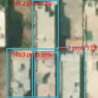
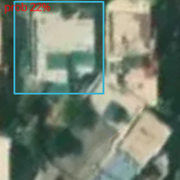

*repo update in progress*

# Augmented Yardstick

The idea was to make a simple and repeatable system of property GIS mapping (primarily for taxation purposes). It uses P.J. Reddie's Darknet (YOLO) (https://pjreddie.com/darknet/) trained to detect properties from satellite images, then obtains the GIS coordinates from the mapping service provider, measures the area covered and writes it to a JSON file. 

The darknet implementation is AlexeyAB fork (https://github.com/AlexeyAB/darknet) through node C++ addon (Node C++ Addon: https://nodejs.org/api/addons.html), which feeds into an electronJS app. The app connects to a satellite service provider (MapBox in this case) and uses its API to extract images and GIS information (MapBox API: https://docs.mapbox.com/api/overview/)

**This makes for**
1. an extremely fast GIS mapping procedure (as opposed to physical survey)
2. a low-cost and repeatable process, since with population growth and expansion of urban areas, surveys have to be done every few years
3. single-point execution, as opposed to a network of regional offices, managing large survey teams.

**There are several obvious issues**
1. for property mapping, GIS experts, would normally collect survey data to pin-point exact corners of each property and then map them for a very (still may not be 100%) accurate measurement. With image detection, it is expected to be a relatively less accurate measurement. (see section Initial Test)
2. not all properties are perfect squares or rectangles. which further deteriorates the accuracy of image detection.
3. the GIS data will still not provide cadastral information, which will have to be collected through physical survey or extracted from existing property records.

**Addressing some Issues**
1. Research shows that in many cases, in the public sector, efficiency is more valuable than accuracy. So it is often recommended to trade-off accuracy for a speedier process. The proposed system can achieve this. If the exchequer can draft the tax law in a way that accounts for some loss of accuracy (e.g. set tariff structure over a range of property sizes) then this can be easily resolved.
2. Not all properties being perfect squares/rectangles is a bit more tricky. Better training of the neural net or training the net for additional features, like domes, greenery, roads, etc. can possibly address this issue. If the net can be modified to **recognize** instead of just detect the properties, as in detect larger number of features as part of a whole, then too this issue may be resolved. This will, obviously, incur more computing cost. (see section Initial Test)
3. Cadastral information can be obtained from existing property records which may already have some location information that can be matched with the GIS information. In regions where property records are not digitized, this becomes a much more difficult task to achieve.

### Initial Test

Initial test was performed to ONLY gauge the effectiveness of the system, whether it does what it was intended to do, NOT how well it does that.

So for the initial test, a total of around 60 positive and 35 negative images were used. This is obviously an **extremely low amount** of data for neural net training.

However, even with this low amount of data, the results were quite convincing. In some cases, where satellite images were pefectly aligned and properties were in perfect rectangles, measurements were very close to the accurate measurement, +/- 5 sq. yards.

    

This leads to believe that with larger dataset, highly specific annotations and increased features, even without implementing a *recognition* algo, the system might still perform to fulfill its purpose, in *statistically significant* more cases than less.

### Instructions

**Darknet**

1. Darknet is implemented using AlexeyAB fork through a Node C++ addon.
2. Weights and config files will have to be added in the node addon implementation.
3. Very basic source files are included (folder cppsrc) but they will have to be implemented in a Node addon project and then compiled.
4. When making the C++ project, darknet and yolo class from AlexeyAB will also have to be included. Add those as per the editor (being used) instructions.

**Node C++ Addon**

1. The node addon implementation is included in testc folder. (index.js)
2. This is where the Darknet config and weights file will have to specified. They are not included.

**Electron App**

1. The entry point for the electron app is the main.js which loads the index.html. ElectronJS and other node modules would have to be included in the project. 
2. The index.html contains all the logic for getting the satellite image from the mapbox API. This is then passed through the main.js to C++ addon where detections are run and values returned for getting GIS data.
3. The app also contains module for writing GIS data to JSON file. Worker threads were used for implementing the writing procedure, but since all the writing has to be done in a single file and the process is I/O intensive, this process may throw a runtime exception from time to time, as multiple threads try to write to the same file.
4. Information on any other required inputs are contained in the source files.

P.S. tried to fix (sort of brute force) this issue by modifying the JSON file after every save but, at the time, there seems to be no work-around for multi-threading an I/O intensive save process.

